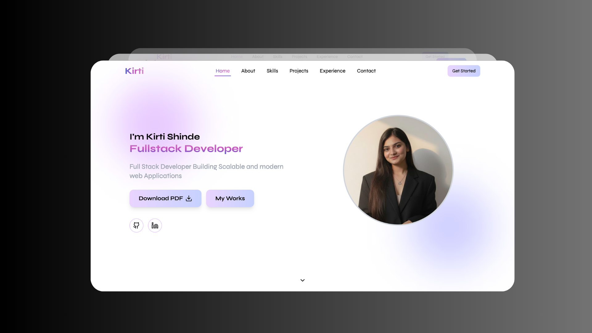
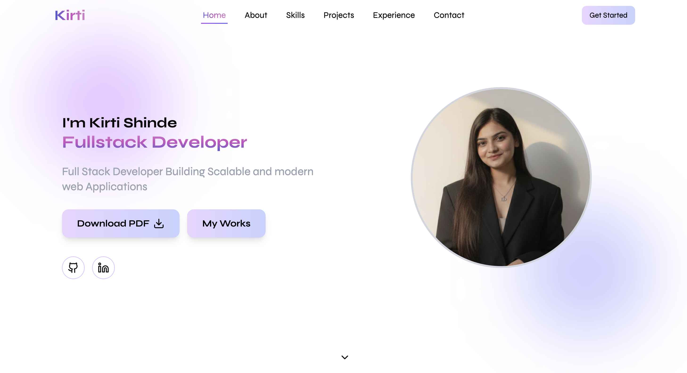
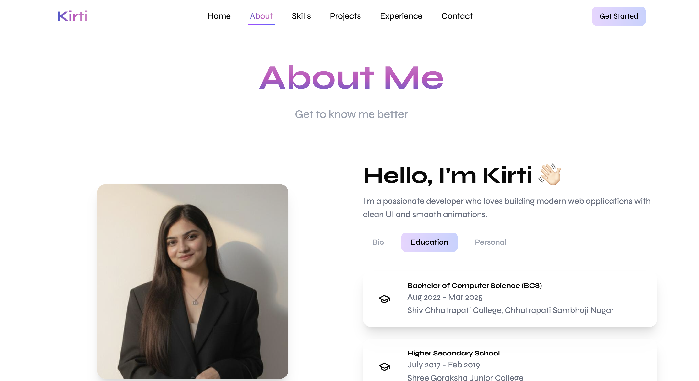
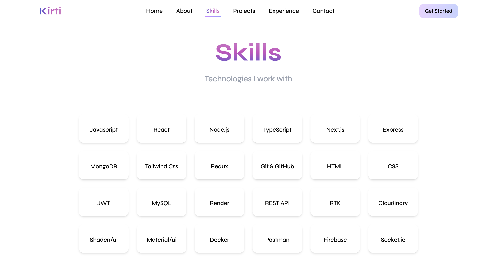
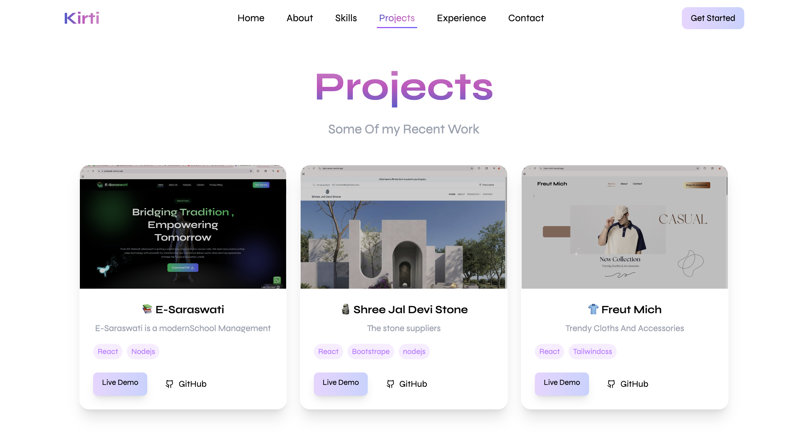
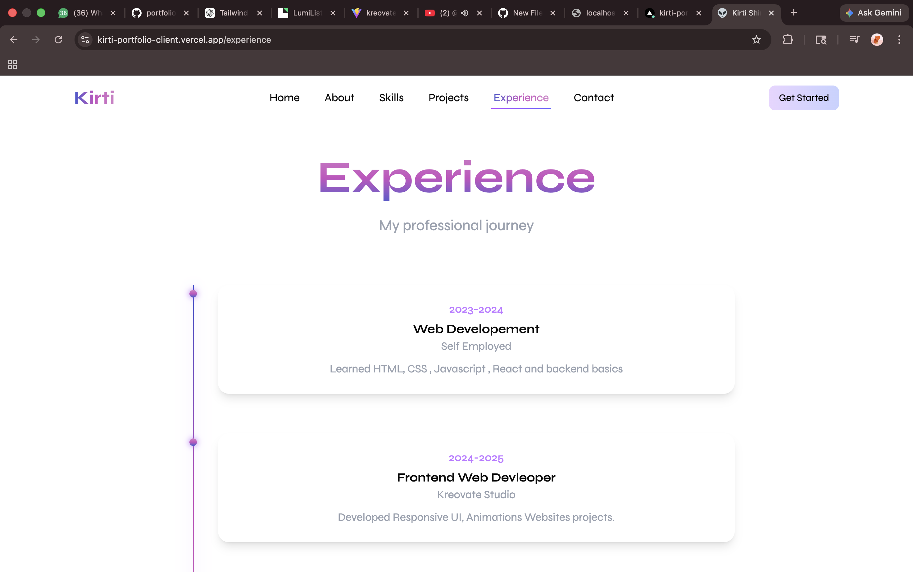
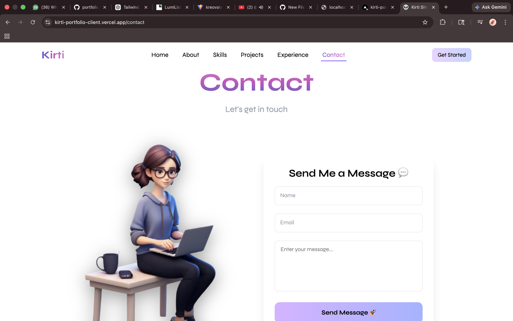
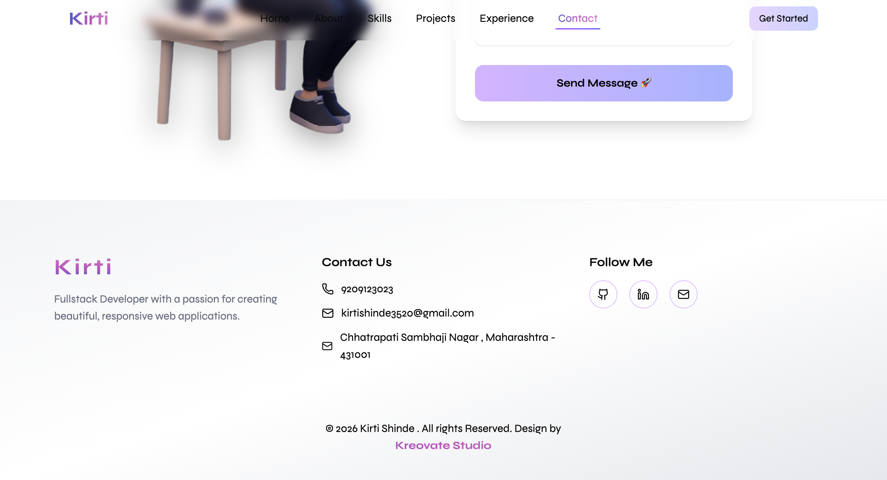
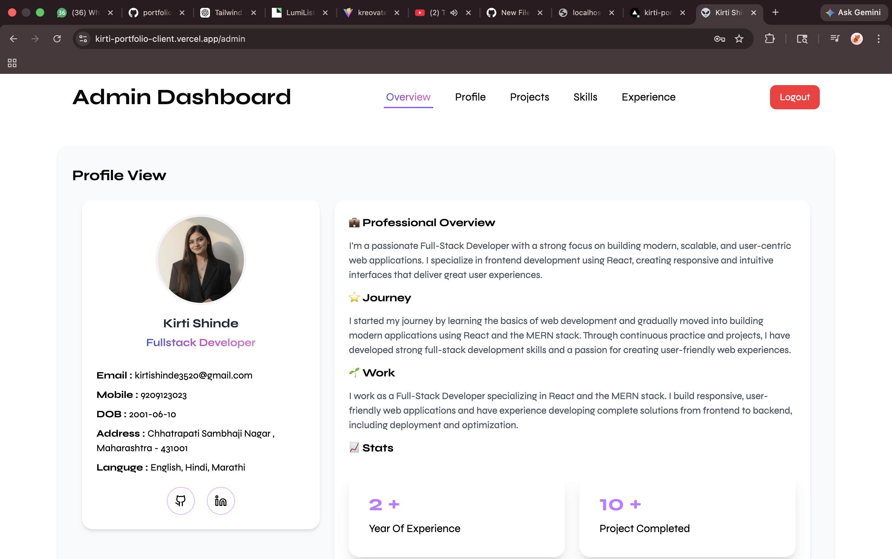

# 🌸 Kirti Shinde – Portfolio using Next.JS

Welcome to my personal portfolio repository! ✨
This project showcases my work, skills, and projects as a developer.

  

## 🚀 Live Demo

## 🛠️ Tech Stack
    

## 📸✨ Preview

---

### 💖 Portfolio UI

  

  
  

  
  

  

---

### 🛠️✨ Admin Panel

  
  

---

  🌸 Clean UI • Responsive • Admin Dashboard 💻✨

